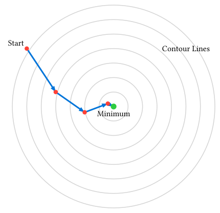

# 関数の最適化

物理学において、ある関数の最小値（または最大値）を求める**最適化 (Optimization)** は極めて重要なテーマです。

- **ポテンシャルエネルギーの最小化**: 系はエネルギーが低い安定な状態に向かいます。
- **モデルフィッティング**: 実験データと理論モデルの誤差（最小二乗法など）を最小にするパラメータを探します。
- **作用最小の原理**: 古典力学の運動は作用積分を最小にする経路をとります。

関数の最小値を与える点では微分（勾配）が $0$ になるため、最適化は「導関数 $= 0$ となる解を見つける」という点で求根問題と密接に関連しています。

## 勾配降下法 (Gradient Descent)

最も基本的かつ直感的な手法が**勾配降下法**です。
「今の場所で一番急な下り坂の方向へ少し進む」ことを繰り返して、谷底（極小値）を目指します。

### アルゴリズム

多変数関数 $f(vb(x))$ の勾配 $grad f(vb(x))$ は、関数が最も増加する方向を向いています。したがって、その逆方向 $-grad f(vb(x))$ へ進めば値を小さくできます。

$$ vb(x)_(n+1) = vb(x)_n - alpha grad f(vb(x)_n) $$

ここで $alpha$ は**学習率 (Learning Rate)** と呼ばれる正のパラメータで、一歩の大きさを調整します。



### Rustによる実装

関数 $f(x, y) = x^2 + y^2$ （お椀型の関数）の最小値 $(0, 0)$ を求めてみましょう。

$$ grad f = (pdv(f, x), pdv(f, y)) = (2x, 2y) $$

```rust
fn sphere(x: &[f64]) -> f64 {
    x[0].powi(2) + x[1].powi(2)
}

fn sphere_gradient(x: &[f64]) -> Vec<f64> {
    vec![2.0 * x[0], 2.0 * x[1]]
}

fn gradient_norm(g: &[f64]) -> f64 {
    g.iter().map(|v| v.powi(2)).sum::<f64>().sqrt()
}

fn gradient_descent(mut x: Vec<f64>, alpha: f64, tolerance: f64, max_iter: usize) -> (Vec<f64>, f64, usize) {
    for i in 0..max_iter {
        let current_val = sphere(&x);
        let g = sphere_gradient(&x);

        // 勾配の大きさが十分小さくなったら終了
        if gradient_norm(&g) < tolerance {
            return (x, current_val, i);
        }

        // 更新 x = x - alpha * grad
        for j in 0..x.len() {
            x[j] -= alpha * g[j];
        }

        println!("iter {}: x={:?}, f(x)={:.6}", i, x, current_val);
    }

    let value = sphere(&x);
    (x, value, max_iter)
}

fn main() {
    let x0 = vec![2.0, 1.0]; // 初期値
    let alpha = 0.4;            // 学習率
    let tolerance = 1e-6;
    let max_iter = 100;

    let (x, value, iter) = gradient_descent(x0, alpha, tolerance, max_iter);
    println!("\n終了: x={:?}, f(x)={:.6} (反復: {})", x, value, iter);
}
```

### 学習率の重要性

- $alpha$ が**小さすぎる**と、収束までに非常に時間がかかります。
- $alpha$ が**大きすぎる**と、谷底を飛び越えてしまい、振動したり発散したりします。

実際に $alpha$ を変えて試してみると、その影響がよく分かります。

## 局所解と大域解

勾配降下法やニュートン法などの反復法には、「初期値の近くにある谷底（**局所的最適解：Local Minima**）」には辿り着けますが、本当の最小値（**大域的最適解：Global Minima**）が見つかるとは限らないという弱点があります。

複雑な地形（多峰性関数）で大域解を見つけるには、より高度な手法（焼きなまし法、遺伝的アルゴリズム、あるいは初期値を多数変えて試すなど）が必要になります。

## 実用的なライブラリ (argmin)

勾配降下法は単純ですが、収束が遅い場合があります（特に谷が細長い場合）。実務でより複雑な問題を解くには、[argmin](https://docs.rs/argmin/latest/argmin/) クレートなどの最適化ライブラリを使用するのが一般的です。

ここでは、最適化のベンチマークとして有名な **Rosenbrock関数** を、強力な準ニュートン法の一種である **L-BFGS法** で解いてみます。

$$ f(x, y) = (1 - x)^2 + 100(y - x^2)^2 $$

この関数は $(1, 1)$ に最小値を持ちますが、細長いバナナ状の谷があるため、単純な勾配降下法では収束に非常に時間がかかります。

### L-BFGS法とは？

L-BFGS (Limited-memory BFGS) 法は、**準ニュートン法**と呼ばれるアルゴリズムの一種です。

- **ニュートン法との違い**: ニュートン法は2階微分（ヘッセ行列）を利用して高速に収束しますが、変数の数 $N$ に対して $O(N^2)$ のメモリと $O(N^3)$ の計算コストが必要です。
- **準ニュートン法 (BFGS)**: ヘッセ行列を直接計算せず、過去の勾配の履歴から「ヘッセ行列の逆行列」を逐次近似します。
- **限定メモリ (L-BFGS)**: 近似に必要な履歴をすべて保存するのではなく、直近の $m$ ステップ分だけを保持することで、メモリ消費を $O(m N)$ にまで抑えます。

この「省メモリかつ高速」という性質により、数万個の原子を扱う分子動力学の構造最適化など、大規模な物理問題におけるデファクトスタンダードとなっています。

`argmin` は数学的な演算部分を抽象化しているため、`ndarray` の配列をパラメータとして使うには、対応するバックエンドを提供する `argmin-math` が必要になります。

**Cargo.toml:**

```toml
[dependencies]
argmin = "0.11"
argmin-math = { version = "0.5", features = ["ndarray_latest"] }
ndarray = "0.16"
ndarray-linalg = { version = "0.17", features = ["openblas-system"] }
```

**使用例:**

```rust,noplayground
use argmin::core::{CostFunction, Error, Executor, Gradient};
use argmin::solver::linesearch::MoreThuenteLineSearch;
use argmin::solver::quasinewton::LBFGS;
use ndarray::{Array1, array};

struct Rosenbrock {}

// 1. 目的関数の定義: f(x)
impl CostFunction for Rosenbrock {
    type Param = Array1<f64>;
    type Output = f64;

    fn cost(&self, p: &Self::Param) -> Result<Self::Output, Error> {
        let (x, y) = (p[0], p[1]);

        Ok((1.0 - x).powi(2) + 100.0 * (y - x.powi(2)).powi(2))
    }
}

// 2. 勾配 (1階微分) の定義: grad f(x)
impl Gradient for Rosenbrock {
    type Param = Array1<f64>;
    type Gradient = Array1<f64>;

    fn gradient(&self, p: &Self::Param) -> Result<Self::Gradient, Error> {
        let (x, y) = (p[0], p[1]);

        let gx = -2.0 * (1.0 - x) - 400.0 * x * (y - x.powi(2));
        let gy = 200.0 * (y - x.powi(2));

        Ok(array![gx, gy])
    }
}

fn rosenbrock_initial_param() -> Array1<f64> {
    array![-1.2, 1.0]
}

fn main() {
    let cost = Rosenbrock {};
    let init_param = rosenbrock_initial_param();

    // L-BFGSソルバーの設定
    // 準ニュートン法では、更新の方向を決めた後に「どれだけ進むか」を決める
    // 行探索 (Line Search) アルゴリズムが必須となります。
    let linesearch = MoreThuenteLineSearch::new();

    // L-BFGS::new(行探索, 記憶する履歴の数)
    // 履歴の数(m)は通常 3~10 程度で十分な性能を発揮します。
    let solver = LBFGS::new(linesearch, 7);

    // 3. Executorによる実行
    let res = Executor::new(cost, solver)
        .configure(|state| {
            state
                .param(init_param) // 初期値
                .max_iters(100) // 最大反復回数
                .target_cost(1e-10) // 目標値に達したら終了
        })
        .run()
        .expect("Optimization failed");

    // 結果の表示 (argmin 0.11では OptimizationResult が返る)
    println!("Result: {}", res);
}
```

### なぜライブラリを使うのか？

- **収束速度**: L-BFGSなどの高度な手法は、勾配降下法よりも遥かに少ない反復回数で解に到達します。
- **頑健性**: 行き過ぎを防ぐための「行探索 (Line Search)」などが組み込まれており、発散しにくいです。
- **スケーラビリティ**: `argmin` は数万次元以上の大規模な問題にも対応できる設計になっています。

## まとめ

- **最適化**は、エネルギー最小化やデータフィッティングなど、物理シミュレーションの基盤となる重要な手法である。
- **勾配降下法**は、勾配の逆方向に進むことで最小値を探索する最も基本的なアルゴリズムである。
- パラメータの更新幅を決める**学習率**の選択は、収束速度や安定性に大きな影響を与える。
- 多くの反復法は**局所最適解**に陥る可能性があり、問題に応じて初期値の選択や高度なアルゴリズムの検討が必要である。

---

本章はこれで終わりです。次は[フーリエ解析](../ch06-fourier/)に進みましょう。
