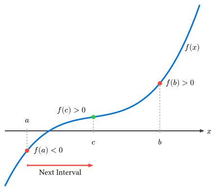
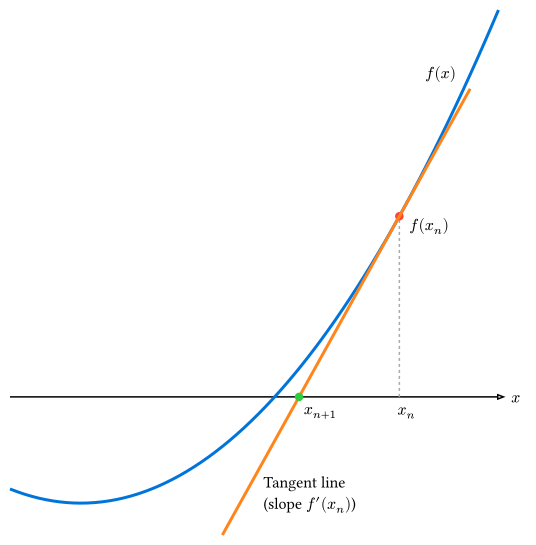

# 非線形方程式の解法

ある関数 $f(x)$ に対して、
$$ f(x) = 0 $$

を満たす $x$ を求める問題を**求根 (Root finding)** と呼びます。

例えば、$x^2 - 2 = 0$ の正の解は $sqrt(2)$ ですが、このような代数方程式だけでなく、$x = cos(x)$ のような超越方程式を解く場面も物理では頻繁に現れます。

本節では、代表的な2つの反復解法である**二分法**と**ニュートン法**を紹介します。

## 二分法 (Bisection Method)

**二分法**は、解が存在する区間を半分ずつに狭めていくことで解を追い詰める、非常にシンプルで堅牢な手法です。

### アルゴリズム

「連続関数 $f(x)$ において、$f(a)$ と $f(b)$ の符号が異なれば、区間 $[a, b]$ の間に少なくとも一つ解が存在する」という**中間値の定理**に基づいています。

1. 解が含まれる初期区間 $[a, b]$ を用意する（ただし $f(a) dot f(b) < 0$ であること）。
2. 区間の中点 $c = (a + b) / 2$ を計算する。
3. $f(c)$ の符号を調べる。
   - $f(c) = 0$ なら、$c$ が解である。
   - $f(a)$ と $f(c)$ が異符号なら、解は $[a, c]$ にあるので、$b -> c$ と更新する。
   - $f(c)$ と $f(b)$ が異符号なら、解は $[c, b]$ にあるので、$a -> c$ と更新する。
4. 区間の幅 $|b - a|$ が許容誤差 $epsilon$ より小さくなるまで繰り返す。



### Rustによる実装

例として、$x^2 - 2 = 0$ を解いて $sqrt(2)$ を求めてみましょう。

```rust
fn bisection<F>(f: F, mut a: f64, mut b: f64, tolerance: f64, max_iter: usize) -> Option<(f64, usize)>
where
    F: Fn(f64) -> f64,
{
    for i in 0..max_iter {
        let c = (a + b) / 2.0;
        let fc = f(c);

        if fc.abs() < tolerance || (b - a).abs() < tolerance {
            return Some((c, i + 1));
        }

        // f(a) * f(c) < 0 なら左側に解がある
        if f(a) * fc < 0.0 {
            b = c;
        } else {
            a = c;
        }
    }

    None
}

fn main() {
    // 解きたい関数: f(x) = x^2 - 2
    let f = |x: f64| x * x - 2.0;

    let tolerance = 1e-8; // 許容誤差
    let max_iter = 100;   // 最大反復回数（無限ループ防止）

    // 初期区間 [1.0, 2.0] には解がある
    match bisection(f, 1.0, 2.0, tolerance, max_iter) {
        Some((root, iter)) => println!("解が見つかりました: x = {:.10} (反復回数: {})", root, iter),
        None => println!("収束しませんでした。"),
    }
}
```

### 特徴

- **長所**: 初期区間に解があれば、必ず収束する（大域的収束性）。
- **短所**: 収束が遅い（1回の反復で精度が1ビット、つまり2進数で1桁しか良くならない）。

## ニュートン法 (Newton's Method)

**ニュートン法（ニュートン・ラフソン法）** は、関数の微分情報 $f'(x)$ を利用して、より高速に解に収束させる手法です。

### アルゴリズム

現在の推定値 $x_n$ における接線を引き、その接線と $x$ 軸との交点を次の推定値 $x_(n+1)$ とします。
テイラー展開の1次近似からも導出できます。

$$ f(x) approx f(x_n) + f'(x_n)(x - x_n) = 0 $$

これを $x$ について解くと更新式が得られます。

$$ x_(n+1) = x_n - f(x_n) / (f'(x_n)) $$



### Rustによる実装

同様に $x^2 - 2 = 0$ を解きます。ここでは導関数 $f'(x) = 2x$ を利用します。

```rust
fn newton<F, G>(f: F, df: G, mut x: f64, tolerance: f64, max_iter: usize) -> Option<(f64, usize)>
where
    F: Fn(f64) -> f64,
    G: Fn(f64) -> f64,
{
    for i in 0..max_iter {
        let fx = f(x);

        if fx.abs() < tolerance {
            return Some((x, i));
        }

        let dfx = df(x);
        // 接線の傾きが0に近いと発散の危険がある
        if dfx.abs() < 1e-10 {
            return None;
        }

        x -= fx / dfx;
    }

    None
}

fn main() {
    let f = |x: f64| x * x - 2.0;
    let df = |x: f64| 2.0 * x; // f(x) の導関数

    let tolerance = 1e-8;
    let max_iter = 100;

    match newton(f, df, 1.0, tolerance, max_iter) {
        Some((root, iter)) => println!("解が見つかりました: x = {:.10} (反復回数: {})", root, iter),
        None => println!("収束しませんでした。"),
    }
}
```

### 特徴

- **長所**: 解の近くでは非常に高速に収束する（**2次収束**: 正しい桁数が反復ごとに倍になる）。
- **短所**:
  - 導関数 $f'(x)$ が必要（数値微分で代用することも可能）。
  - 初期値が解から遠いと収束しないことがある（局所的収束性）。
  - $f'(x) approx 0$ となる場所では不安定になる。

## どちらを使うべきか？

- **二分法**: とにかく安全に解きたいとき、関数の性質がよく分からないとき。
- **ニュートン法**: 微分が計算でき、高速に解きたいとき。初期値の良い推定ができるとき。

実用的には、これらを組み合わせた**ブレント法 (Brent's Method)** などが多くの数値計算ライブラリで採用されています（最初は安全な二分法などを使い、解に近づいたら高速な手法に切り替えるアルゴリズムです）。

### 実用的なライブラリ (Brent法)

実務で求根を行う場合、Brent法を自前で実装するのは複雑でバグの原因になりやすいため、通常はライブラリを使用します。
Rustでは、例えば [roots](https://docs.rs/roots/latest/roots/) クレートなどが利用できます。

```toml
[dependencies]
roots = "0.0.8"
```

**使用例:**

```rust,noplayground
use roots::find_root_brent;
use roots::SimpleConvergency;

fn solve_sqrt2_with_brent() -> Result<f64, roots::SearchError> {
    let f = |x: f64| x * x - 2.0;
    let mut convergency = SimpleConvergency { eps: 1e-15f64, max_iter: 30 };

    // 区間 [1.0, 2.0] で解を探す
    // find_root_brent(初期区間始点, 初期区間終点, 関数, 収束条件)
    find_root_brent(1.0, 2.0, &f, &mut convergency)
}

fn main() {
    match solve_sqrt2_with_brent() {
        Ok(val) => println!("解: {}", val),
        Err(e) => println!("エラー: {:?}", e),
    }
}
```

## まとめ

- **二分法**は、解を挟む区間を縮小していく手法で、確実に収束するが速度は遅い。
- **ニュートン法**は、微係数を利用して解を探索する手法で、高速に収束するが適切な初期値が必要である。
- 実用的な問題では、安定性と速度を兼ね備えた**ブレント法**が推奨される。Rustでは `roots` クレートを利用することで手軽に実装できる。

---

[次節](./multivariable-newton.md)では、変数が複数ある場合の連立非線形方程式の解法について学びます。
