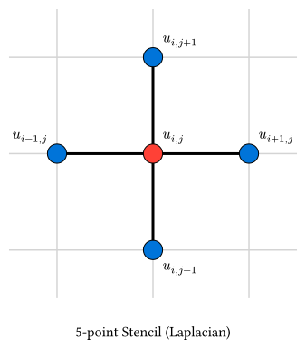

# 差分法の基礎

> [!NOTE]
> **本節のポイント**
>
> - 偏微分方程式を離散化する基本的な考え方である差分法を理解する。
> - 1階および2階偏微分の差分近似式を導出する。
> - 計算の安定性を左右するCFL条件の概念を学ぶ。
> - 境界条件の種類と実装上の工夫（ゴーストセル）を知る。

偏微分方程式をコンピュータで解くために、連続的な空間や時間を格子状に分割して離散化する手法を**差分法 (Finite Difference Method, FDM)** と呼びます。

## 離散化の表記

空間$x$を刻み幅$Delta x$で、時間$t$を刻み幅$Delta t$で分割します。
点$(x_i, t_n) = (i Delta x, n Delta t)$における関数の値を$u_i^n$と表記します。

## 偏微分の差分近似

[数値微分と数値積分](../ch03-calculus/)で学んだ数値微分の手法を、偏微分にも適用します。これらの公式は、テイラー展開から導くことができます。

点$x$における関数$u(x)$を$Delta x$だけずれた点でテイラー展開すると：
$$ u(x + Delta x) = u(x) + pdv(u, x) Delta x + 1/2 pdv(u, x, 2) (Delta x)^2 + 1/6 pdv(u, x, 3) (Delta x)^3 + O(Delta x^4) $$

$$ u(x - Delta x) = u(x) - pdv(u, x) Delta x + 1/2 pdv(u, x, 2) (Delta x)^2 - 1/6 pdv(u, x, 3) (Delta x)^3 + O(Delta x^4) $$

### 1階偏微分

上の第1式から $pdv(u, x)$ について解くと、**前進差分** が得られます：
$$ pdv(u, x) = (u(x + Delta x) - u(x)) / (Delta x) + O(Delta x) $$

第1式から第2式を引くと、**中心差分** が得られます：
$$ pdv(u, x) = (u(x + Delta x) - u(x - Delta x)) / (2 Delta x) + O(Delta x^2) $$

中心差分の方が誤差のオーダーが小さく、精度が良いことがわかります。

### 2階偏微分

第1式と第2式を足し合わせると、$pdv(u, x)$の項が消え、2階微分（ラプラシアン）の近似式が得られます：
$$ u(x + Delta x) + u(x - Delta x) = 2u(x) + pdv(u, x, 2) (Delta x)^2 + O(Delta x^4) $$

$$ arrow.r pdv(u, x, 2) approx (u(x + Delta x) - 2u(x) + u(x - Delta x)) / (Delta x^2) $$

これを多次元に拡張すると：

- **1次元の場合**:
  $$ pdv(u, x, 2) approx (u_(i+1)^n - 2u_i^n + u_(i-1)^n) / (Delta x^2) $$

- **2次元の場合（5点差分近似）**:
  $$ nabla^2 u = pdv(u, x, 2) + pdv(u, y, 2) approx (u_(i+1,j)^n + u_(i-1,j)^n + u_(i,j+1)^n + u_(i,j-1)^n - 4u_(i,j)^n) / (Delta x^2) $$
  （ここで$Delta x = Delta y$と仮定）



このように、ある点でのラプラシアンを計算するために周囲の点を利用する形を**ステンシル (Stencil)** と呼びます。上の図は2次元の5点ステンシルを表しており、中心点（赤）の更新に上下左右の4点（青）が関わっていることを示しています。

## 安定性と収束性

PDEの数値計算において最も重要な概念の一つが**安定性**です。
不適切な$Delta t$や$Delta x$の組み合わせを選ぶと、計算結果が指数関数的に増大して破綻（発散）してしまいます。

### CFL条件 (Courant-Friedrichs-Lewy Condition)

波動の伝播などを陽的な差分スキームで解く際、「数値的な情報の伝達速度が、物理的な波の速度を上回っていなければならない」という条件です。
1次元波動方程式の標準的な中心差分スキームでは、波の速度を$c$とすると、以下の条件が必要になります。

$$ c (Delta t)/(Delta x) lt.eq 1 $$

この条件を満たさない場合、計算は不安定になります。具体的な上限値は方程式、空間次元、離散化スキームによって変わります。

## 境界条件

PDEを解くには、領域の端での振る舞いを指定する必要があります。

- **ディリクレ境界条件**: 境界での値を固定する（例：端の温度を$0$度に保つ）。
- **ノイマン境界条件**: 境界での微分係数（フラックス）を固定する（例：断熱条件$pdv(u, x) = 0$）。
- **周期境界条件**: 右端と左端がつながっているとみなす。

<details>
<summary>補足: ノイマン境界条件の実装（ゴーストセル）</summary>

「端での傾き（微分）が0」という条件$pdv(u, x) = 0$を差分法で実装する場合、単純な前進・後退差分よりも、中心差分を使った方が精度が良くなります。

しかし、境界点（例えば$i=0$）で中心差分を取ろうとすると、領域外の点$u_(-1)$が必要になります。
$$ (u_1 - u_(-1)) / (2 Delta x) = 0 arrow.r u_(-1) = u_1 $$

このように、計算のためだけに導入する仮想的な格子点を**ゴーストセル (Ghost Cell)** と呼びます。
拡散方程式などの更新式において、$u_0$を更新する際に$u_(-1)$が出てきたら、それを $u_1$ で置き換えることで、自然にノイマン条件（断熱条件）を組み込むことができます。

</details>

## Rustによるデータの表現と計算

偏微分方程式では大量の格子点データを扱うため、`ndarray`ライブラリを活用します。単なる配列の確保だけでなく、**スライス演算** を利用すると、差分計算をループなしで数学の公式に近い形で記述できます。
例として、関数$u(x) = sin(x)$の1階微分を中心差分で求めてみましょう。

```rust,noplayground
use ndarray::{Array1, s};
use std::f64::consts::PI;

fn centered_first_derivative(u: &Array1<f64>, dx: f64) -> Array1<f64> {
    let nx = u.len();

    // du/dx[i] = (u[i+1] - u[i-1]) / (2*dx)
    // s![2..] は 2番目以降、s![..nx-2] は 最後から2つ目までを指す
    (&u.slice(s![2..]) - &u.slice(s![..nx - 2])) / (2.0 * dx)
}

fn main() {
    let nx = 100;
    let x_min = 0.0;
    let x_max = 2.0 * PI;
    let dx = (x_max - x_min) / (nx - 1) as f64;

    // 1. 格子点の生成 (linspace)
    let x = Array1::linspace(x_min, x_max, nx);

    // 2. 関数の値を計算: u = sin(x)
    let u = x.mapv(|v| v.sin());

    // 3. 中心差分による数値微分を一括計算
    let du_dx_num = centered_first_derivative(&u, dx);

    // 4. 解析解 (cos(x)) との比較
    let x_inner = x.slice(s![1..nx - 1]);
    let du_dx_exact = x_inner.mapv(|v| v.cos());

    // 中央付近（x = PI）の結果を表示
    let mid = nx / 2;

    println!("x = {:.4}", x_inner[mid]);
    println!("Numerical: {:.6}", du_dx_num[mid]);
    println!("Exact:     {:.6}", du_dx_exact[mid]);
    println!(
        "Error:     {:.2e}",
        (du_dx_num[mid] - du_dx_exact[mid]).abs()
    );
}
```

```text
x = 3.2368
Numerical: -0.994804
Exact:     -0.995472
Error:     6.68e-4
```

### ndarray スライスのポイント

- **`s![2..]`と`s![..nx-2]`**: インデックスをずらした「ビュー」を作成しています。これらを引き算することで、全格子点に対する`u[i+1] - u[i-1]`を一気に計算できます。
- **効率**: この書き方は内部で最適化され、明示的なループを書くのと同等、あるいはそれ以上の速度で動作します。また、多次元配列（2D/3D）への拡張も容易です。

## まとめ

- **差分法**は、微分を格子点上の値の差で近似する手法。
- 空間には中心差分、時間には前進差分（または後退差分）がよく用いられる。
- **CFL条件**などの安定性条件を満たすように刻み幅$Delta t, Delta x$を選ぶ必要がある。
- 境界条件にはディリクレ、ノイマン、周期境界などがある。

## 参考リンク

- [Finite difference method - Wikipedia](https://en.wikipedia.org/wiki/Finite_difference_method)
- [Courant-Friedrichs-Lewy condition - Wikipedia](https://en.wikipedia.org/wiki/Courant%E2%80%93Friedrichs%E2%80%93Lewy_condition)

---

[次節](./diffusion.md)では、具体例として拡散方程式を解いてみましょう。
