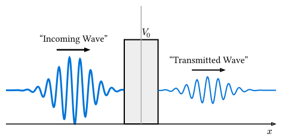

# 散乱問題とトンネル効果

量子力学特有の現象として最も有名なのが**トンネル効果 (Quantum Tunneling)** です。
古典力学では乗り越えられないエネルギーの障壁を、量子的な粒子は確率的に透過してしまう現象です。

## シミュレーション設定

- **初期状態**: ガウス波束（ある平均運動量 $k_0$ を持って右へ進む粒子）
- **ポテンシャル**: 経路の途中に壁（ポテンシャル障壁 $V(x) > 0$）を設置



## Rustによる実装（簡易版）

ここでは、波束・障壁・確率密度の形を見るために、簡易的な陽的 Euler 法を用いたデモコードを示します。陽的 Euler 法はシュレーディンガー方程式のユニタリ性を保存せず、任意の有限な$Delta t$で長時間安定な時間発展にはなりません。本格的には前節のスプリット演算子法かクランク・ニコルソン法を使用してください。

```rust
use num_complex::Complex64;

const N: usize = 200;
const L: f64 = 100.0;
const DT: f64 = 0.05;
const DX: f64 = L / N as f64;

fn gaussian_wave_packet(x0: f64, sigma: f64, k0: f64) -> Vec<Complex64> {
    (0..N).map(|i| {
        let x = i as f64 * DX;

        // exp(-(x-x0)^2 / 2sigma^2) * exp(i k0 x)
        let envelope = (-(x - x0).powi(2) / (2.0 * sigma.powi(2))).exp();
        let phase = Complex64::from_polar(1.0, k0 * x);
        Complex64::new(envelope, 0.0) * phase
    }).collect()
}

fn barrier_potential(start: f64, width: f64, height: f64) -> Vec<f64> {
    (0..N).map(|i| {
        let x = i as f64 * DX;
        if x > start && x < start + width { height } else { 0.0 }
    }).collect()
}

fn explicit_euler_step(psi: &[Complex64], potential: &[f64]) -> Vec<Complex64> {
    // psi(t+dt) = psi(t) - i * dt * H * psi(t)
    let mut next_psi = psi.to_vec();

    for i in 1..N - 1 {
        let kinetic = -0.5 * (psi[i + 1] - 2.0 * psi[i] + psi[i - 1]) / (DX * DX);
        let potential_energy = potential[i] * psi[i];
        let h_psi = kinetic + potential_energy;

        next_psi[i] = psi[i] - Complex64::i() * DT * h_psi;
    }

    next_psi
}

fn max_probability(psi: &[Complex64]) -> f64 {
    psi.iter().map(|z| z.norm_sqr()).fold(0.0_f64, f64::max)
}

fn evolve_scattering(
    mut psi: Vec<Complex64>,
    potential: &[f64],
    n_steps: usize,
    sample_interval: usize,
) -> (Vec<Complex64>, Vec<(usize, f64)>) {
    let mut samples = Vec::new();

    // 時間発展ループ
    for t in 0..n_steps {
        if t % sample_interval == 0 {
            // ここで |psi|^2 を出力してプロットすると、波束の動きが見える
            samples.push((t, max_probability(&psi)));
        }

        // オイラー法 (不安定なので注意)
        psi = explicit_euler_step(&psi, potential);
    }

    (psi, samples)
}

fn main() {
    // 波動関数の初期化 (ガウス波束)
    let x0 = L / 4.0;
    let sigma: f64 = 5.0;
    let k0 = 2.0; // 平均運動量
    let psi = gaussian_wave_packet(x0, sigma, k0);

    // ポテンシャル障壁
    let potential = barrier_potential(L / 2.0, 5.0, 1.5);
    let (_psi_final, samples) = evolve_scattering(psi, &potential, 200, 20);

    for (step, probability) in samples {
        println!("Step {}: max probability = {:.4}", step, probability);
    }
}
```

## 結果の観察

このシミュレーションを実行すると、波束が壁に衝突した際、一部が反射し、一部が壁を通り抜けて透過していく様子が観察できます。
壁の高さが粒子のエネルギーよりも高くても、透過波が存在することが確認できます。

## 透過係数と反射係数

規格化された波動関数に対して、壁の向こう側（透過領域）における確率密度の積分値が**透過係数 (Transmission Coefficient)** です。

$$ T = integral_("barrier end")^infinity |psi(x, t)|^2 dd(x) $$

離散格子では、透過領域の$|psi_i|^2$を足し合わせ、最後に$Delta x$を掛けて近似します。十分に時間が経過した後、この $T$ は定数値に収束します。解析解と比較することで、シミュレーションの精度を検証できます。

## 参考リンク

- [Quantum tunnelling - Wikipedia](https://en.wikipedia.org/wiki/Quantum_tunnelling)
- [Crank-Nicolson method - Wikipedia](https://en.wikipedia.org/wiki/Crank%E2%80%93Nicolson_method)
- [Strang splitting - Wikipedia](https://en.wikipedia.org/wiki/Strang_splitting)
