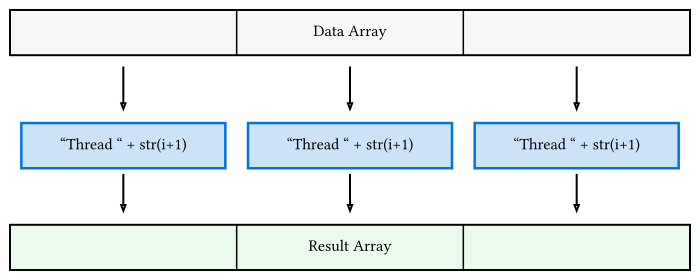

# Rayonによるデータ並列化

Rustにおいて、マルチコアCPUを活用した並列処理を最も手軽に、かつ安全に導入できるのが **Rayon** クレートです。
Rayonは「データ並列性 (Data Parallelism)」に特化しており、イテレータを並列化するだけで劇的な速度向上が期待できます。

## Rayonの導入

`Cargo.toml` に追加します。

```toml
[dependencies]
rayon = "1.11"
```

## 並列イテレータの使い方

Rayonの最大の特徴は、標準ライブラリのイテレータ (`iter()`, `iter_mut()`) を `par_iter()`, `par_iter_mut()` に書き換えるだけで、自動的にスレッドプールへのタスク割り当て（ワークスティーリング）が行われる点です。



### 実践例：モンテカルロ法による円周率の推定

並列化の効果が分かりやすい例として、大量の乱数を用いた円周率の計算を考えます。

```rust
use rand::Rng;
use rayon::iter::{IntoParallelIterator, ParallelIterator};

fn estimate_pi(n_samples: usize) -> f64 {
    // 各サンプルが独立しているため、並列化が非常に容易
    let count: usize = (0..n_samples)
        .into_par_iter() // 並列イテレータに変換
        .map(|_| {
            let mut rng = rand::thread_rng();
            let x: f64 = rng.gen();
            let y: f64 = rng.gen();
            if x * x + y * y <= 1.0 { 1 } else { 0 }
        })
        .sum();

    4.0 * count as f64 / n_samples as f64
}

fn main() {
    let n = 10_000_000;
    let start = std::time::Instant::now();
    let pi = estimate_pi(n);
    let duration = start.elapsed();

    println!("Estimated Pi: {}, Time: {:?}", pi, duration);
}
```

この例では、`into_par_iter()` を使うことで、数千万回のループがCPUコア数に合わせて自動的に分割・実行されます。計算量が多いほど、並列化による恩恵が顕著になります。

## 数値計算への応用：多粒子系の力計算

[第11章の分子動力学](../ch11-fluid-dynamics/)などで、全粒子ペアに対して力を計算する場面を考えます。

```rust
use ndarray::{Array2, Axis};
use rayon::iter::{IntoParallelIterator, ParallelIterator};

fn compute_forces_parallel(positions: &Array2<f64>, forces: &mut Array2<f64>) {
    let n = positions.nrows();

    // 各粒子の力を独立に計算（実際には作用反作用の利用などで工夫が必要）
    // ここでは各粒子の更新ループを並列化する例
    forces.axis_iter_mut(Axis(0))
          .into_par_iter()
          .enumerate()
          .for_each(|(i, mut force_i)| {
              for j in 0..n {
                  if i == j { continue; }
                  // 粒子 j から i に働く力を計算して force_i に加算
              }
          });
}
```

## なぜ安全なのか？

Rustの型システム（`Send` と `Sync` トレイト）が、スレッド間で共有してはいけないデータの受け渡しをコンパイル時に拒否します。
例えば、複数のスレッドから同時に同じメモリ領域を可変参照しようとするとコンパイルエラーになるため、Rayonを使っている限りデータ競合を心配する必要がありません。

## 注意点：オーバーヘッド

並列化すれば必ず速くなるわけではありません。

- **データ量が少ない場合**: スレッドの生成やタスク分割のコストが、計算の短縮分を上回ることがあります。
- **計算内容が軽すぎる場合**: 各タスクの実行時間が短すぎると、管理コストが支配的になります。

まずはプロファイリングを行い、計算負荷の高いループを見極めることが重要です。
